# 程序编码

## 机器级代码

计算机系统使用了多种不同形式的抽象，利用更简单的抽象模型来隐藏实现的细节。其中两种抽象尤为重要。
1. ``指令集架构(Instruction Set Architecture, ISA)``来定义机器级程序的格式和行为，它定义了处理器状态、指令的格式、以及每条指令对状态的影响。
2. 机器级程序使用的内存地址是虚拟地址，提供的内存模型看上去是一个非常大的字节数组。

- ``程序计数器(通常称为PC,在x86-64中用%rip表示)给出将要执行的下一条指令在内存中的地址``
- ``整数寄存器文件``包含16个命名的位置，分别存储64位的值。这些寄存器可以存储地址或整数数据，有的寄存器被用来记录某些重要的程序状态，而其他的寄存器用来保存临时数据，例如过程的参数和局部变量，以及函数的返回值。
- ``条件码寄存器``保存着最近执行的算数或逻辑指令的状态信息。它们用来实现控制或数据流中的条件变化，比如用来实现的if和while语句。
- ``向量寄存器``可以存放一个或多个整数或浮点数值。

程序内存包含：程序的可执行机器代码，操作系统需要的一些信息，用来管理过程调用和返回的运行时栈，以及用户分配的内存块(比如用malloc函数分配的)。

# 数据格式

| C声明  | Intel数据类型 | 汇编代码后缀 | 大小(字节) |
| ----- | -----------  | ---------- | --------  |
| char  | 字节         | b          | 1         |
| short | 字           | w          | 2         |
| int   | 双字         | l          | 4         |
| long  | 四字         | q          | 8         |
| char* | 四字         | q          | 8         |
| float | 单精度        | s          | 4        |
| double| 双精度       | l           | 8        |

# 访问信息

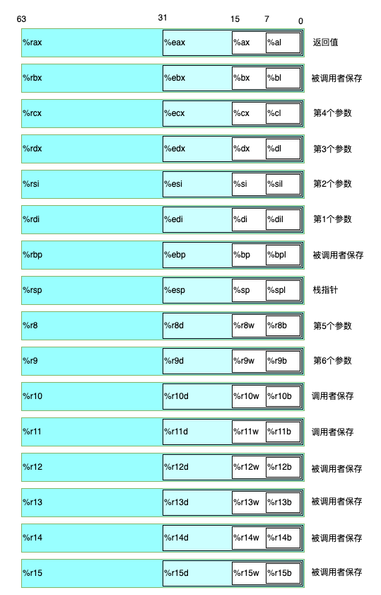

## 操作数指示符

大多数指令有一个或多个操作数(operand)，指示出执行一个操作中要使用的源数据值，以及放置结果的目的位置。

操作数的可能性分为3种类型：

1. ``立即数(immediate)``,用来表示常数值。如：$-577,$0x1f。
2. ``寄存器(register)``,它表示某个寄存器的内容，16个寄存器的低位1字节、2字节、4字节或8字节中的一个作为操作数，这些字节数分别对应于8位、16位、32位或64位。我们用符号$r_{a}$来表示任意寄存器a,用引用$R[r_{a}]$来表示它的值，这是将寄存器集合看成一个数组R,用寄存器标识符作为索引。
3. ``内存引用``,他会根据计算出来的地址(通常称为有效地址)访问某个内存位置。因为将内存看成一个很大的字节数组。

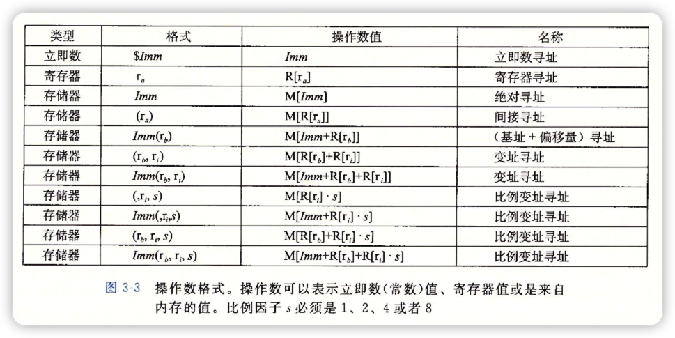

| 类型     | 格式                  | 操作数值                          | 名称            |
| :-----: | :------------------: | :----------------------------:   | :-----------:  |
| 立即数   | $Imm                 | Imm                              | 立即数寻址       |
| 寄存器   | $r_{a}$              | $R[r_{a}]$                       | 寄存器寻址       |
| 存储器   | Imm                  | M[Imm]                           | 绝对寻址         |
| 存储器   | $(r_{a})$            | $M[R[r_{a}]]$                    | 间接寻址         |
| 存储器   | $Imm(r_{b})$         | $M[Imm+R[r_{b}]]$                | (基址+偏移量)寻址 |
| 存储器   | $(r_{b},r_{i})$      | $M[R[r_{b}]+R[r_{i}]]$           | 变址寻址         |
| 存储器   | $Imm(r_{b},r_{i})$   | $M[Imm+R[r_{b}]+R[r_{i}]]$       | 变址寻址         |
| 存储器   | $(,r_{i},s)$         | $M[R[r_{i}]*s]$                  | 比例变址寻址      |
| 存储器   | $Imm(,r_{i},s)$      | $M[Imm+R[r_{i}]*s]$              | 比例变址寻址      |
| 存储器   | $(r_{b},r_{i},s)$    | $M[R[r_{b}]+R[r_{i}]*s]$         | 比例变址寻址      |
| 存储器   | $(r_{b},r_{i},s)$    | $M[Imm+R[r_{b}]+R[r_{i}]*s]$     | 比例变址寻址      |

操作数可以表示立即数(常数)值、寄存器值或来自内存的值。比例因子s必须是1、2、4、8

## 数据传送指令

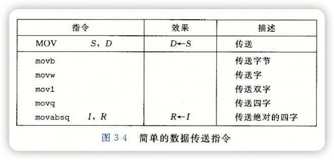


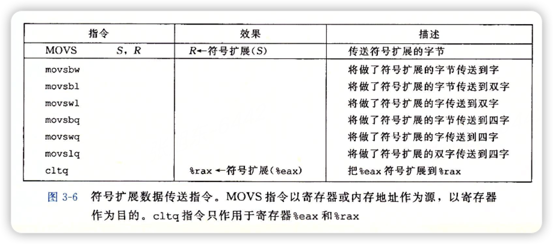

例：MOV指令示例给出了源和目的类型的五种可能的组合。第一个是源操作数，第二个是目的操作数

```s
movl $0x4050,%eax           Immediate--Register, 4bytes
movw %bp,%ep                Register--Register, 2Bytes
movb (%rdi,%rcx),%al        Memory--Register, 1byte
movb $-17,(%rsp)            Immediate--Memory, 1byte
movq %rax,-12(%rbp)         Register--Memory, 8bytes
```

## 压入和弹出栈数据

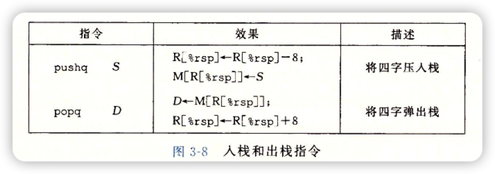

将一个四字值压入栈中，首先要将栈指针减8，然后将值写到新的栈顶地址。因此，指令``pushq %rbp``的行为等价于下面两条指令：

```s
subq $8,%rsp            Decrement stack pointer
movq %rbp,(%rsp)        Store %rbp on stack
```

弹出一个四字的操作包括从栈顶位置读出数据，然后将栈指针加8。因此，指令``popq %rax``的行为等价于下面两条指令：

```s
movq (%rsp),%rax        Read %rax from stack
addq $8,%rsp            Increment stack pointer
```
# 算术和逻辑操作


## 加载有效地址

``加载有效地址(load effective address)``指令leaq实际上是movq指令的变形。它的指令形式是从内存读取数据到寄存器，但实际上它根本没有引用内存。它的第一个操作数看上去是一个内存引用，但该指令并不是从指定的位置读入数据，而是将有效地址写入到目的操作数。

例：
```s
leaq 7(%rdx,%rdx,4),%rax    将设置寄存器%rax的值为5x+7
```

```c
long scale(long x, long y, long z)
{
    long t = x + 4 * y + 12 * z;
    return t;
}
```

编译时，该函数的算术运算以三条leaq指令实现
```s
long scale(long x, long y, long z)
x in %rdi, y in %rsi, z in %rdx
scale:
    leaq (%rdi,%rsi,4),%rax     x+4*y
    leaq (%rdx,%rdx,2),%rdx     z+2z=3z
    leaq (%rax,%rdx,4),%rax     (x+4*y) + 4*(3*z) = x+4*y+12*z
```

## 一元和二元操作

一元操作，只有一个操作数，既是源又是目的。这个操作数可以是一个寄存器，也可以是一个内存位置。

二元操作，其中，第二个操作数既是源又是目的

## 移位操作

移位操作，先给出移位量，然后第二项给出的是要移位的数。可以进行算术和逻辑右移。
移位量可以是一个立即数，或者放在单字节寄存器%cl中。这些指令很特别，因为只允许以这个特定的寄存器作为操作数。
左移指令有两个名字：SAL和SHL。两者的效果是一样的，都是将右边填上0。
右移指令不同，SAR执行算术移位(填上符号位)，而SHR执行逻辑移位(填上0)。
移位的目的操作数可以是一个寄存器或是一个内存位置。

## 特殊的算术操作

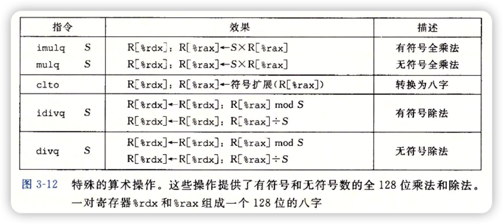

# 控制

C语言中的某些结构，比如条件语句、循环语句和分支语句，要求有条件的执行，根据数据测试的结果来决定操作执行的顺序。机器代码提供两种基本的低级机制来实现有条件的行为：测试数据值，然后根据测试的结果来改变控制流或数据流

## 条件码

除了整数寄存器，CPU还维护着一组单个位的``条件码(condition code)``寄存器，它们描述了最近的算术或逻辑操作的属性。可以检测这些寄存器来执行条件分支指令。最常用的条件码有：

- CF: 进位标志。最近的操作使最高位产生了进位。可用来检查无符号操作的溢出。
- ZF: 零标志。最近的操作得出的结果为0.
- SF: 符号标志。最近的操作得到的结果为负数。
- OF: 溢出标志。最近的操作导致一个补码溢出-正溢出或负溢出。

## 访问条件码

条件码通常不会直接读取，常用的使用方法有3种：

1. 根据条件码的某种组合，将一个字节设置为0或1
2. 可以条件跳转到程序的某个其他的部分
3. 可以有条件的传送数据

对于第一种情况，根据SET指令设置相应的值

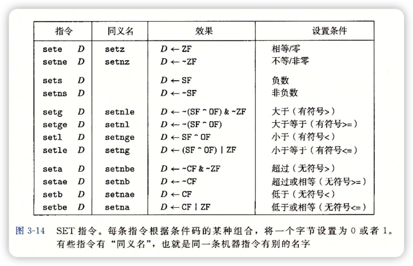

如何进行设置，考虑下面代码

```c
int comp(char a, char b)
{
    return (a < b);
}
```

如果a<b,那么a-b为负,SF=1,但仅仅依靠符号位并不能准确进行判断。不妨令t=a-b，则有

| 案例        | a和b比较                  | t             | SF  |  OF  | SF ^ OF |
| :--------: | :----------------------: | :----------:  | :-: |  :-: | :----:  |
| case1      | a < b                    | t < 0         | 1   | 0    | 1       |
| case2      | a > b                    | t > 0         | 0   | 0    | 0       |
| case3      | a < b,a = -2, b = 127    | t = 127 > 0   | 0   | 1    | 1       |
| case4      | a > b,a = 1, b = -128    | t = -127 < 0  | 1   | 1    | 0       |

在case 3 和case 4 中，由于发生了溢出，符号标志的值判断出现了误差，所以采用 SF^OF的值来判断 a 是否小于 b ，如果SF^OF = 1，根据SET指令中的setl设置相应的寄存器的字节

因此，我们往往需要通过条件码的组合来对低位单字节寄存器进行操作

## 跳转指令

正常执行的情况下，指令按照它们出现的顺序一条一条的执行。``跳转(jump)``指令会导致执行切换到程序中一个全新的位置。

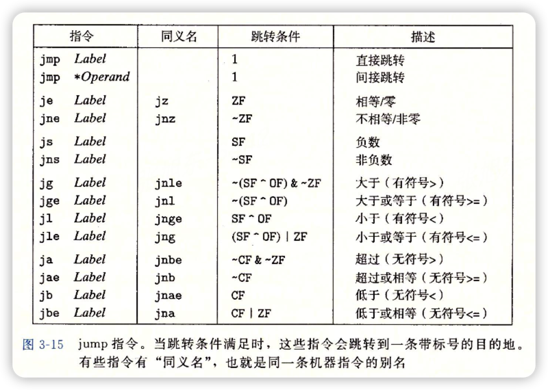

## 用条件控制来实现条件分支

## 用条件传送来实现条件分支

## 循环

# 过程

过程是软件中一个很重要的抽象。它提供了一种封装代码的方式，用一组指定的参数和一个可选的返回值实现了某种功能。不同编程语言中，过程的形式多样：``函数(function)``、``方法(method)``、``子例程(subroutine)``、``处理函数(handler)``等等。

假设过程P调用过程Q,Q执行后返回到P。这些动作包括下面一个或多个机制:

- ``传递控制``。在进入过程Q的时候，程序计数器必须被设置为Q的代码的起始位置，然后在返回时，要把程序计数器设置为P中调用Q后面那条指令的地址。
- ``传递数据``。P必须能够向Q提供一个或多个参数，Q必须能够向P返回一个值。
- ``分配和释放内存``。在开始时，Q可能需要为局部变量分配空间，而在返回前，又必须释放这些存储空间。

## 运行时栈

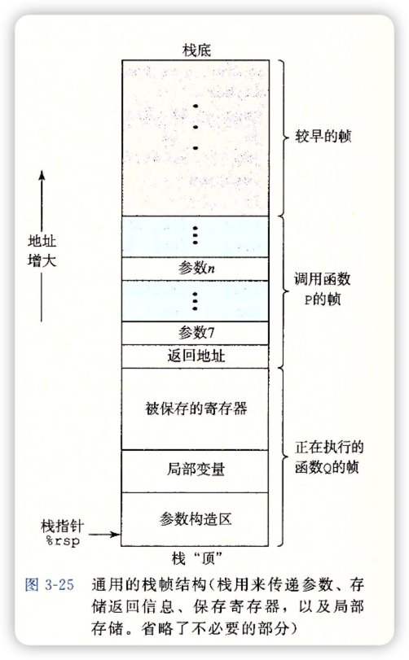

## 转移控制

将控制从函数P转移到函数Q只需要简单的把程序计数器(PC)设置为Q的代码的起始位置。不过，当从Q返回的时候，处理器必须记录号它需要继续的执行的代码位置。在x86-64机器中，这个信息是用指令call Q调用过程Q来记录的。该指令会把地址A压入栈中，并把PC设置为Q的起始位置。压入的地址A被称为返回地址，是紧跟在call指令后面的那条指令的地址。对应的指令ret会从栈中弹出地址A，并把PC设置为A。

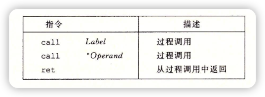

## 数据传送

当调用一个过程时，除了要把控制传递给它并在过程返回时再传递回来外，过程调用还可能包括把数据作为参数传递，而从过程返回还有可能包括一个值。在x86-64中，大部分过程间的数据传送是通过寄存器实现的。例如，参数在寄存器%rdi、%rsi和其他寄存器中传递。当过程P调用过程Q时，P的代码可以访问寄存器%rax中的返回值。

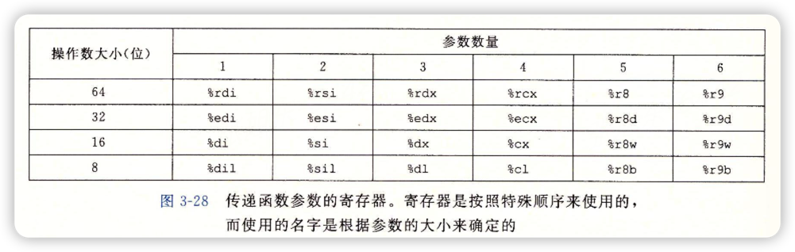

## 栈上的局部存储

局部数据在某些情况下必须放在内存中，常见的情况包括：

- 寄存器不足够存放所有的本地数据。
- 对一个局部变量使用地址运算符'&'，因此必须能够为它产生一个地址。
- 某些局部变量是数组或结构，因此必须能够通过数组或结构引用被访问到。

## 寄存器中的局部存储空间

**寄存器组是唯一被所有过程共享的资源。** 虽然在给定时刻只有一个过程是活动的，我们仍然必须确保当一个过程(调用者)调用另一个过程(被调用者)时，被调用者不会覆盖调用者稍后会使用的寄存器值。为此，x86-64采用了一组统一的寄存器使用惯例。

根据惯例，寄存器%rbx、%rbp和%r12~%r15被划分为调用者保存寄存器。当过程P调用过程Q时，Q必须保存这些寄存器的值，保证它们的值在Q返回到P时与Q被调用时是一样的。过程Q保存一个寄存器的值不变，要么就是根本不去改变它，要么就是把原始值压入栈中，改变寄存器的值，然后在返回前从栈中弹出旧值。

# 数组分配和访问

## 基本原则

对于数据类型T和整形常数N，声明如下：

**T A[N]**;起始位置表示为$x_{A}$。这个声明有两个效果。首先，它咋内存中分配了一个L*N字节的连续区域，这里L是数据类型T的大小(单位为字节)。其次，它引入了标识符A，可以用A来作为指向数组开头的指针，这个指针的值就是$x_{A}$。可以用0~N-1的整数索引来访问该数组元素。数组元素i会被存放在地址为$x_{A}+L*i$的地方。


## 指针运算

C语言允许对指针进行运算，而计算出来的值会根据该指针引用的数据类型的大小进行伸缩。也就是说，如果p是一个指向类型为T的数据的指针，p的值为$x_{p}$，那么表达式p+i的值为$x_{p}+L*i$，这里L是数据类型T的大小。

# 异质的数据结构

## 结构

C语言的struct声明创建一个数据类型，将可能不同类型的对象合到一个对象中。用名字来引用结构的各个组成部分。类似于数组的实现，结构的所有组成部分存放在内存中一段连续的区域内，而指向结构的指针就是结构第一个字节的地址。编译器维护关于每个结构类型的信息，指示每个字段的字节偏移。它以这些偏移作为内存引用指令中的位移，从而产生对结构元素的引用。

## 数据对齐

许多计算机系统对基本数据类型的合法地址做出了一些限制，要求某种类型对象的地址必须是某个值K(通常是2、4或8)的倍数。例如，假设一个处理器总是从内存中取8个字节，则地址必须为8的倍数。如果我们能保证将所有的double类型数据的地址对齐成8的倍数，那么就可以用一个内存操作来读或者写值了。否则，我们可能需要执行两次内存访问，因为对象可能被分放在两个8字节内存快中。

```c
struct S1
{
    int i;
    char c;
    int j;
}
```

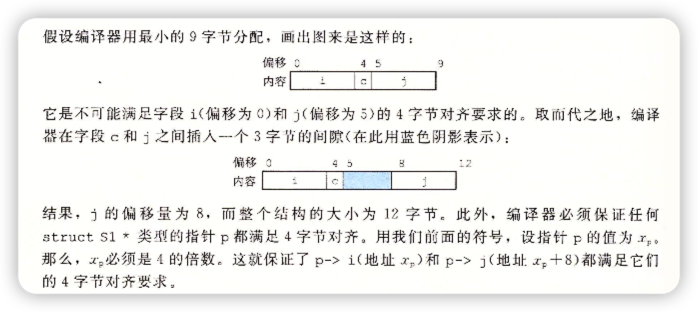

# 在机器级程序中将控制与数据结合起来

## 理解指针

- 每个指针都对应一个类型。
- 每个指针都有一个值。
- 指针用'&'运算符创建。
- 操作符用于间接引用指针。
- 数组与指针紧密联系。
- 将指针从一种类型强制转换为另一种类型，只改变它的类型，而不改变它的值。
- 指针也可以指向函数。函数指针的值是该函数机器代码表示中第一条指令的地址。